<!-- https://github.com/kyechan99/capsule-render -->

  

<!-- https://github.com/DenverCoder1/readme-typing-svg -->

  

  <!-- 以下三张卡片由 .github/workflows/update-cards.yml 生成并提交到 profile/ 目录 -->
  <!-- https://github.com/anuraghazra/github-readme-stats -->
  
  <!-- https://github.com/DenverCoder1/github-readme-streak-stats -->
  
   
  <!-- https://github.com/Ashutosh00710/github-readme-activity-graph -->
  
   
  <!-- https://github.com/tandpfun/skill-icons -->
  

<!-- https://github.com/badges/shields -->

  
  
  <!-- https://github.com/antonkomarev/github-profile-views-counter -->
  

<!-- https://github.com/kyechan99/capsule-render -->

  

